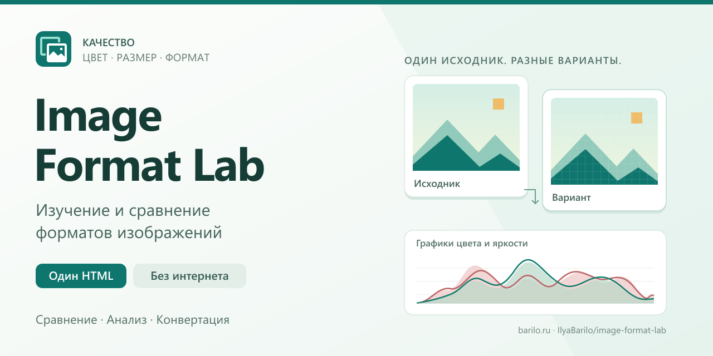

# Image Format Lab

**Изучение и сравнение форматов изображений.**

Локальный инструмент для сравнения качества и размера изображений и пакетной
конвертации. Подходит для занятий по веб-графике, экспериментов со сжатием
и подготовки файлов для сайта.

**Один HTML-файл · Работа без интернета · Сравнение 2/4 · Пакетная обработка**

**[Скачать HTML из последнего релиза](https://github.com/IlyaBarilo/image-format-lab/releases/latest/download/image-format-lab.html)**

Скачайте `image-format-lab.html` из Releases и откройте файл в браузере.

Исходники библиотек размещаются рядом с HTML в том же
[релизе](https://github.com/IlyaBarilo/image-format-lab/releases/latest):
`gifenc-1.0.3-sources.zip` и `heic-sources.zip`. Для запуска достаточно HTML.

[Быстрый старт](FIRST-STEPS.md) · [Руководство](docs/USAGE.md) ·
[Сборка](src/README.md) · [Лицензии](NOTICE.md) ·
[Обратная связь](#обратная-связь)

Автор: [Илья Барило (Ilya Barilo)](https://barilo.ru/).
Собственный код — [MIT](LICENSE); у библиотек [собственные условия](NOTICE.md).



## Быстрый запуск

1. Скачайте [image-format-lab.html из последнего релиза](https://github.com/IlyaBarilo/image-format-lab/releases/latest/download/image-format-lab.html)
   на компьютер.
2. Откройте сохранённый HTML в современном браузере.
3. Нажмите **Образец** для первого знакомства или **Добавить** для своих изображений.
4. Выберите вид **2/4**, форматы и параметры вариантов. Сравните изображение,
   размер файла и метрики, затем скачайте нужный результат.

Первый результат: исходник и его перекодированные варианты видны рядом,
под каждым вариантом показаны размер и метрики, доступно скачивание.
[Первый эксперимент: исходник, JPEG 85/25 и PNG](FIRST-STEPS.md#первый-эксперимент).

Для готового приложения достаточно этого HTML: внутри находятся стили,
JavaScript, вычислительный Worker и дополнительные кодеки. Установка, сервер,
Node.js и соседние папки не нужны. Ничего скачивать не требуется.
Крупные кодеки хранятся сжатыми внутри HTML и автоматически распаковываются в памяти.

## Возможности

| Задача | Что можно сделать |
| --- | --- |
| Сравнить форматы | Два или четыре варианта одного исходника, синхронный масштаб и перемещение, совмещение вариантов 1 и 2 с подвижной границей, сетка пикселей при увеличении, режим 100%, фон для проверки прозрачности |
| Оценить потери | Размер и доля от исходного файла, PSNR RGB на белой подложке, отдельная ошибка прозрачности Δα |
| Исследовать цвет и яркостный сигнал | Панель «Анализ»: гистограммы RGB/alpha/Y′CbCr, Waveform яркости и RGB, RGB/Y′CbCr Parade и вектороскоп для текущих 2/4 ячеек, общие шкалы и подложка |
| Проверить границы и градиенты | Профиль RGB/Y′/alpha вдоль общей линии, выбор мышью или координатами, числовые показания и сохранение узких пиков |
| Найти отличия в изображении | Карты различий, гистограмма и профиль попиксельных ошибок RGB/alpha с исходником; MAE, RMSE и отдельный одномасштабный SSIM по точным RGBA8/16 пикселям, выбор области для анализа |
| Проверить отдельный пиксель | Раскрываемый инспектор RGBA, точные значения 8/16 бит, выбор точки или координат и разница с исходником |
| Узнать свойства файла | Паспорт исходника и результатов JPEG/PNG: размеры, разрядность, свойства кодирования, наличие метаданных, bpp, ограниченная карта блоков файла и отдельно объём рабочего растра и времена обработки результата |
| Сопоставить результаты на графике | Наложение пары ячеек; точки размера/PSNR, ошибки alpha или времени обработки по готовым результатам |
| Сохранить анализ | PNG графиков с подписями и методикой; JSON с параметрами, метриками и рассчитанными массивами |
| Повторить эксперимент | Готовые сценарии для фотографий, прозрачности и палитры; именованные настройки, их импорт и экспорт |
| Сохранить сравнение | CSV/JSON с параметрами и метриками, без содержимого изображений |
| Обработать несколько файлов | Общий список, выбор флажками, окно пакета, уменьшение и предпросмотр «До/После» |
| Уложиться в размер файла | Подбор качества JPEG/WebP/AVIF/HEIC/JPEG XL под бюджет в КБ в заданных пределах |
| Скачать набор | Отдельные файлы или ZIP, частичный результат при отмене, повтор ошибок |

Настройки сравнения и пакета независимы. Предпросмотр пакета позволяет проверить
результат до запуска всего набора. Тема, расположение панелей, параметры сравнения
и настройки диаграмм запоминаются автоматически. **Сброс настроек** справа рядом
с темой возвращает начальные значения, сохраняя файлы и именованные наборы.
Параметры пакета сохраняются после подтверждения в его окне; файлы и очередь
между сеансами не восстанавливаются. [Подробности](docs/USAGE.md).

## Форматы

| Формат | Открытие | Сохранение |
| --- | --- | --- |
| JPEG | Средствами браузера; JPEG-in-TIFF — встроенный libjpeg-turbo | Встроенный libjpeg-turbo: качество 1–100, цветность 4:4:4 / 4:2:2 / 4:2:0, обычный или прогрессивный JPEG; заливка прозрачности |
| PNG | PNG8 — браузер; PNG16 — точное чтение серых/RGB/RGBA, включая Adam7 | Полные цвета: Авто / 8 / 16 бит на канал, PNG16 в исходном размере; палитра: 2–256 цветов, дизеринг, двоичная прозрачность, индексы 1/2/4/8 бит; PNG opt: UPNG/pako, 8 бит на канал |
| WebP | Браузер или встроенный libwebp | Обычный WebP — браузер; **WebP lossless** — встроенный libwebp 1.6.0 с методом сжатия 0–6 |
| AVIF | Встроенные libheif / libaom | Встроенный libaom 3.15.0, качество 1–100 и скорость кодирования 0–9 |
| JPEG XL | Встроенный libjxl 0.12.0 | **JPEG XL** с качеством 1–100 или отдельный **JPEG XL lossless**; усилие кодирования 1–10 |
| ICO | Наибольший PNG внутри ICO — браузер; BMP внутри ICO — встроенный libnsbmp | 7 PNG-размеров: 16, 24, 32, 48, 64, 128, 256 px |
| GIF | Средствами браузера | Один кадр: собственный кодировщик или gifenc, палитра и двоичная прозрачность |
| BMP | Встроенный libnsbmp: палитры, RGB555/565, RGB24/32, RLE4/8 и битовые маски в пределах поддержки | 8 бит с палитрой до 256 цветов, без сжатия или RLE8; 24 бит RGB или 32 бит RGBA без сжатия |
| TIFF | Встроенный libtiff: TIFF/BigTIFF, раздельные каналы, ориентация; UTIF / libjpeg-turbo для JPEG-in-TIFF и lossless JPEG | TIFF RGBA8 без потерь: без сжатия, Deflate, LZW или PackBits; настройки уровня и предиктора для применимых режимов |
| HEIC/HEIF | Браузер; при отказе — встроенные libheif 1.23.4 / libde265 1.1.2, основное изображение HEVC | HEIC: libheif + Kvazaar 2.3.2, качество 1–100 |
| Исходный файл | — | Скачивание исходных байтов без перекодирования |

AVIF, JPEG XL и WebP lossless работают автономно. Поддержка всех разновидностей
TIFF/HEIC/JPEG XL не гарантируется; кодеки запускаются при открытии HTML.
PNG16 сохраняет исходные 16-битные отсчёты. Другие lossless-режимы сохраняют
пиксели RGBA8, поступившие на кодирование, без обещания сохранить исходную
разрядность, профиль, метаданные или анимацию.
В ICO пропорции сохраняются, свободное место прозрачно; маленькие исходники
не растягиваются. Предпросмотр показывает вариант 256×256.
HEIC сохраняется как обычное неподвижное изображение `.heic` с HEVC внутри.
Доступны сравнение, предпросмотр, изменение размера и пакетный экспорт. Выход —
8-bit SDR, 4:2:0; качество 100 не означает lossless, прозрачность также может
сжиматься с потерями. HDR, Live Photos и метаданные камеры не воспроизводятся.

Состав библиотек, лицензии и исходники HEIC/JPEG — в [NOTICE](NOTICE.md).

Для **PNG** над изображением и в пакете выбирают режим **Полные цвета / Палитра / PNG opt**.
Разрядность **Авто / 8 / 16 бит на канал** относится к полноцветному PNG;
число цветов и дизеринг — к палитровому.
Авто сохраняет разрядность рабочих пикселей. Точный PNG16 поддерживает серый,
серый с alpha, RGB и RGBA, обычные строки и Adam7; метрики и гистограмма используют
все 16 бит, изображение на экране — отдельную 8-битную копию. Другие графики
и кодеки пока используют 8 бит; это обозначается в интерфейсе и отчётах.
PNG16 сохраняется в исходном размере. Для уменьшения выберите 8 бит явно.
Предел точного пути — **12 Мп**, входной файл — **128 МиБ**.
Поддерживаются метка sRGB или отсутствие цветовых блоков; ICC, отдельные gAMA/cHRM
и HDR-описания отклоняются с пояснением. Полноценного управления цветом нет.
Увеличение разрядности 8 → 16 не восстанавливает утраченные детали.
[Подробности PNG16](docs/USAGE.md#png16).

Режим **PNG → Палитра** и собственный **GIF** используют одинаковое преобразование цветов
при одинаковом числе цветов и положении дизеринга. В «Экспериментах» готовый
сценарий сравнивает их размеры и результат. Кнопка **Формат ⓘ** у ячейки
показывает записи палитры, число использованных индексов и пикселей каждого цвета;
эти числа входят в отчёты. Палитровый PNG ограничен 8 Мп и использует
8-битное представление исходника.

Для **BMP** над изображением доступна **Разрядность**: **8 бит · палитра**
с выбором максимального числа цветов и сжатия RLE8, **24 бита · RGB**
с заливкой прозрачных областей или **32 бита · RGBA** с сохранением прозрачности.
Те же настройки есть в пакетной конвертации. BMP 24/32 сохраняются без сжатия.

Настройки сжатия TIFF доступны прямо над изображением: **Сжатие**, **Уровень**
и **Предиктор**. Уровень отображается для Deflate, предиктор — для Deflate и LZW.
PackBits доступен как отдельный режим без уровня и предиктора.
В пакетной конвертации они открываются кнопкой **Настройки…**.
Параметры меняют размер файла и время обработки, сохраняя
пиксели RGBA8. При открытии многостраничного TIFF используется первая страница.
16-битные TIFF приводятся к 8-битным каналам для просмотра и сравнения;
сохранение 16-bit/HDR и внешние TIFF-кодеки ZSTD, LZMA, LERC, JBIG и WebP
в этой сборке не поддерживаются. JPEG-варианты ограничены возможностями
совместимого пути UTIF / libjpeg-turbo.

## Локальные данные и ограничения

- Изображения обрабатываются на устройстве и не отправляются приложением на сервер.
  Сохранённые настройки находятся в localStorage этого браузера. Отчёт содержит
  имена файлов; изображения в него не входят.
- В «Экспериментах» доступны три контрольных PNG-образца и протокол опыта JSON
  с хешами исходного и выходных файлов, настройками и результатами.
- Серия качества сравнивает два формата на одном исходнике, показывает размер,
  bpp и PSNR для проверенных значений качества и выделяет лучший результат
  в заданном бюджете и недоминируемые точки. Результат можно сохранить в JSON
  с SHA-256 исходника; прерванная серия отмечается как частичная.
- Перекодирование сохраняет **один неподвижный кадр или одну страницу**.
  Анимация, остальные страницы и изображения многокадрового контейнера не переносятся.
- JPEG/BMP8/BMP24 заменяют прозрачность заливкой; GIF поддерживает двоичную прозрачность.
  Для JPEG можно сохранить GPano с пересчётом при уменьшении. Прочие исходные
  метаданные не копируются; точный PNG записывает известную метку sRGB,
  а неизвестное описание оставляет неизвестным. Сохранение ICC/HDR через Canvas не гарантируется.
- HEIC, AVIF, JPEG XL и TIFF открываются в отдельных Worker; входной файл — до **256 МиБ**, результат — RGBA8.
  Поворот и отражение HEIF применяются, 10-битный цвет приводится к 8-битному.
- Общий предел исходника — **40 мегапикселей**; для точного PNG16 — **12 Мп**.
  Предел накопленных результатов ZIP — **256 МиБ**.
  Это ограничения приложения, а не гарантия пикового расхода памяти декодера.
- Подбор размера выполняет до 21 пробы качества. Он выбирает лучшее подходящее
  значение из проверенных и не меняет разрешение без заданных границ уменьшения.
  Если бюджет не достигнут, файл не выдаётся как успешный результат.
- Время в отчёте относится ко всему процессу обработки, включая ожидание.
  PSNR RGB не заменяет визуальную оценку; Δα отдельно оценивает прозрачность.

Подробности масштаба, метрик, настроек и поведения пакета — в [руководстве](docs/USAGE.md).

## Разработка и сборка

Нужны Node.js 18+ и npm; в CI используется Node.js 24.16.0.
В каталоге проекта выполните:

```sh
npm ci --prefix scripts
npm --prefix scripts run build
```

Исходники находятся в `src/`. Результат — **image-format-lab.html в корне**.
HTML создаётся сборкой и не хранится в Git. Готовые версии публикуются в Releases.
Оба npm-манифеста находятся в `scripts/`; зависимости устанавливаются
в `scripts/node_modules/`. Все команды выше выполняются из корня проекта.
Редактируйте исходники: ручные изменения сгенерированного HTML заменяются сборкой.
Первичная установка зависимостей требует доступа к npm; после неё сборка использует
локальные файлы. Кодеки закреплены в `vendor/` и проверяются по SHA-256.

```sh
npm --prefix scripts run dev                 # Пересобирать при изменениях
npm --prefix scripts run build -- --check    # Проверить актуальность HTML
npm --prefix scripts run test:build          # Проверить сборку без браузера
```

Для полной проверки `npm --prefix scripts test` дополнительно нужны Playwright с Chromium и Python
с Pillow. Настройка окружения и отдельные наборы — в [tests/README.md](tests/README.md).
Эти инструменты не входят в готовый HTML. Проверки GPano создают синтетическую
панораму в памяти и не требуют демонстрационных фотографий из рабочей папки.

## Структура проекта

```text
src/                            HTML-шаблон, CSS и JS-модули
scripts/                        Сборка, npm-манифесты и подготовка библиотек
.github/                        Проверки Actions и сборка после публикации релиза
vendor/                         Закреплённые библиотеки, лицензии, манифест
tests/                          Проверки алгоритмов, сборки и браузерных сценариев
docs/                           Руководства и лицензионные тексты
```

## Документация

- [Первые шаги](FIRST-STEPS.md) и [подробное руководство](docs/USAGE.md).
- [Работа без интернета](docs/OFFLINE.md) и [устройство исходников](src/README.md).
- [Для разработчика](docs/DEVELOPMENT.md) и [проверки](tests/README.md).
- [Подготовка публикации](docs/PUBLISHING.md) и [GitHub Actions](docs/CI.md).

## Обратная связь

Задать вопрос или сообщить об ошибке можно в разделе
[«Помощь»](https://github.com/IlyaBarilo/image-format-lab/discussions/categories/q-a).
Предложить улучшение — в
[«Идеях»](https://github.com/IlyaBarilo/image-format-lab/discussions/categories/ideas).

Порядок сообщения об уязвимостях — в [SECURITY.md](SECURITY.md).

## Автор и лицензии

Автор — [Илья Барило (Ilya Barilo)](https://barilo.ru/).

Собственный код и документация — [MIT](LICENSE).
Сторонние компоненты — [лицензии и уведомления](NOTICE.md).
Изображения и другие материалы — [условия использования](ASSETS.md).
